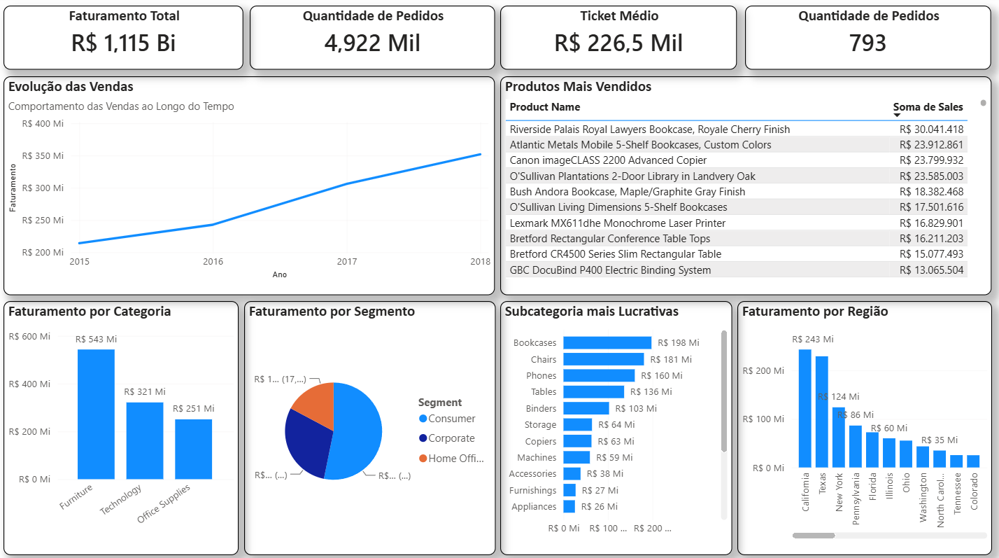

# 📊 Projeto Analítico: Inteligência de Vendas - Supermarket Americano

## 📝 Visão Geral do Projeto
Este projeto foi desenvolvido para simular um cenário real de Business Intelligence. A partir de uma base de dados histórica de transações de um supermercado americano, realizei o processo completo de ETL, modelagem e criação de um painel estratégico para responder a perguntas cruciais da diretoria comercial, transformando dados brutos em tomadas de decisão.

---

## 📁 Estrutura do Repositório
O projeto está organizado da seguinte forma:
* **`Dados/`**: Contém o arquivo original com a base de dados utilizada.
* **`Imagens/`**: Capturas de tela (prints) do relatório final para visualização rápida.

---

## 🎯 Perguntas de Negócio Respondidas

O dashboard foi desenhado especificamente para sanar as seguintes dores dos stakeholders:

### 1. Quanto a empresa faturou?
* **Insight Comercial:** [R$ 1,115 BI]. Este KPI principal foi destacado estrategicamente para acompanhamento rápido da saúde financeira do negócio.

  

### 2. Quais produtos vendem mais?
* **Insight Comercial:** [Riverside palais royal, atlantic metals mobil 5, Canon Imagem CLASS 2000...]. Essa informação permite otimizar a gestão de estoque e planejar campanhas de marketing direcionadas para os itens de maior giro.
  

  

### 3. Qual região vende mais?
* **Insight Comercial:** [California, Texas, New York...]. Identificar a distribuição geográfica ajuda na alocação eficiente de investimentos e recursos logísticos.
  

  

### 4. Qual categoria é mais lucrativa?
* **Insight Comercial:** [Funiture com 543 Milhões em faturamento]. Esse insight mostra que faturamento nem sempre é sinônimo de lucro.
  

  

### 5. Como as vendas evoluem ao longo do tempo?
* **Insight Comercial:** [Identificamos uma forte sazonalidade com picos de vendas concentrados no quarto trimestre (Q4) de cada ano e baixas no primeiro]. Permite a previsibilidade de caixa e planejamento de compras antecipadas.

---

## 🛠️ Ferramentas e Técnicas Utilizadas
* **Power Query (ETL):** Limpeza de dados, tratamento de valores nulos, tipagem de dados e criação de colunas condicionais.
* **Linguagem DAX:** Criação de medidas calculadas essenciais para o negócio (Faturamento Total, Lucro Total, Margem de Lucro %, Quantidade Vendida e inteligência temporal).
* **Storytelling & UX Design:** Layout focado na experiência do usuário, utilizando uma paleta de cores harmônica, navegação intuitiva e disposição de gráficos que facilitam a leitura rápida dos dados.

---

## 🖼️ Visualização do Dashboard

  

---

## 📈 Conclusões e Recomendações Estratégicas
Com base nos dados analisados, as recomendações para o negócio são:
1. **Foco em Margem:** Incentivar as vendas da categoria mais lucrativa, visto que o retorno sobre a venda é superior.
2. **Ação em Regiões Frias:** Desenvolver planos de ação para as regiões com menor desempenho para entender o comportamento do consumidor local.
3. **Planejamento Sazonal:** Antecipar compras com fornecedores antes dos meses de pico histórico para evitar quebra de estoque.

## ✉️ Contato
Desenvolvido por **Willian Cardoso** - Vamos nos conectar!

  

  

